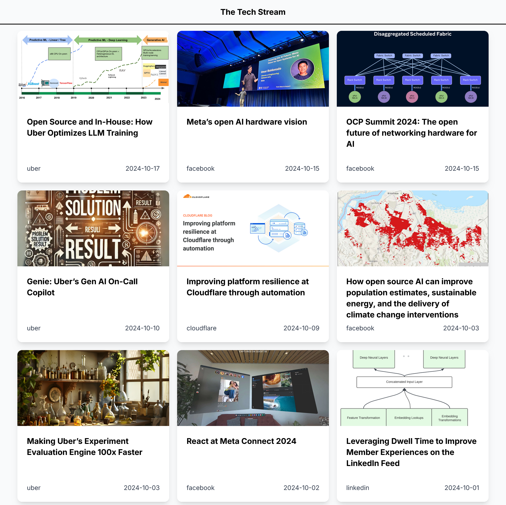

## Feed

## Technical Details
**database:** postgresQL

**scraping:** using python scrapy framework, scraping engineering blogs from the internet and persisting them in the database.

**server:** built using golang (Gin Framework), it implements key set pagination when retreiving blog posts from the database.

**ui:** the frontend is built using next-js, the main page display a feed of engineering blog posts, as user scrolls the feed will load more posts.
## Deployment Plan
For deployment I am planning to use AWS:

